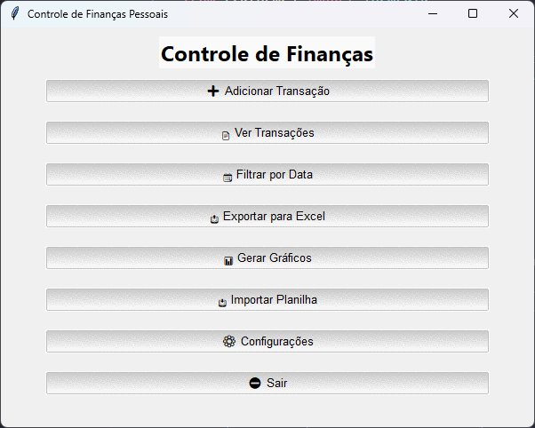
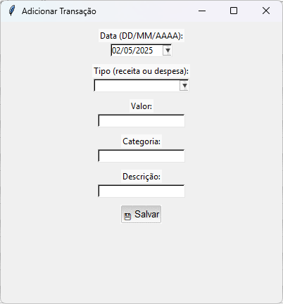
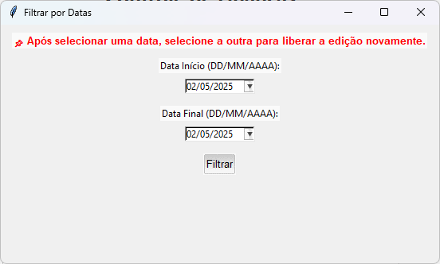
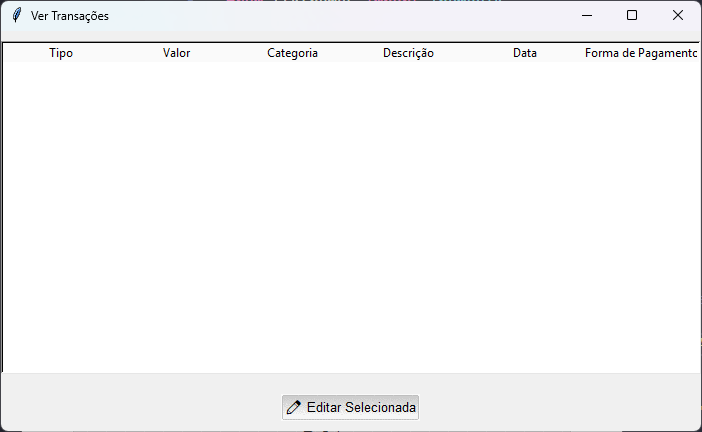

# 💸 Controle de Finanças Pessoais

Um aplicativo simples e poderoso para gerenciar receitas, despesas, saldo e cartões de crédito — com interface gráfica em Python.

---

## 📦 Funcionalidades

✅ Adicionar transações (receitas e despesas)  
✅ Classificar despesas por **categoria**  
✅ Escolher **forma de pagamento**: Débito/Pix ou Crédito  
✅ Definir **data de vencimento da fatura do cartão** (com débito automático mensal)  
✅ Visualizar todas as transações em tabela interativa  
✅ Editar transações diretamente na tabela  
✅ Filtrar transações por data  
✅ Gerar gráficos:
- 📈 Entradas, Saídas e Saldo no tempo  
- 🥧 Gastos por categoria
✅ Exportar transações para Excel (`.xlsx`) com filtro por data e formatação automática  
✅ Interface gráfica moderna com emojis e visual amigável

---

## 🛠️ Tecnologias e bibliotecas utilizadas

- **Python 3.x**
- **Tkinter** → interface gráfica  
- **ttkthemes** → temas visuais para Tkinter  
- **tkcalendar** → campos de seleção de data  
- **Matplotlib** → geração de gráficos  
- **Pandas** → manipulação de dados e exportação  
- **Openpyxl** → exportação e formatação de planilhas Excel  
- **Collections (defaultdict)** → contagem de categorias  
- **Datetime** → manipulação de datas  
- **JSON** → armazenamento local de dados  
- **OS** → operações no sistema de arquivos

---

## 🚀 Como rodar o projeto

1️⃣ Clone o repositório:

git clone https://github.com/seu-usuario/controle-financas.git

2️⃣ Instale as dependências:

pip install tkcalendar ttkthemes matplotlib pandas openpyxl

3️⃣ Execute a aplicação:

python interface.py

## 💻 Como gerar o executável

1️⃣ Instale o pyinstaller:

pip install pyinstaller

2️⃣ Gere o executável:

pyinstaller --onefile --windowed interface.py

O executável estará na pasta dist/.

📸 Imagens do sistema:

🤝 Contribuição
Sinta-se à vontade para abrir issues e pull requests!